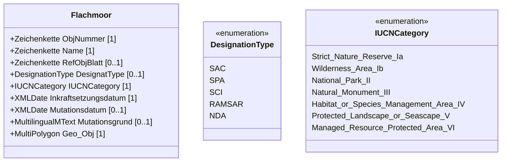

# Bundesinventar der Flachmoore von nationaler Bedeutung
<details>
  
<summary>Dokumentinformationen</summary>

**FIG**
- Mitglieder der AG gitKBNL
- Catherine Guex
- Frederic Aubert (VD) 2010
- Andreas Lienhard (ZH)
-  Stefan Meier (AG)
-  Markus Müller Egli (LU)
-  Remo Bianchi (SZ)
-  Matthias Künzler (TG) 2009
-  Rolf Niederer (TG) ab 2010
-  Norbert Danuser (GR)
-  Simone Serretti (TI)
-  Stefan Rey (ZG)
-  Peter Zopfi (GL), bis 2009
-  Rolf Zürcher, KOGIS
-  Mirjam Zehner, KKGEO
-  Dominik Angst,
-  BAFU Helmut Recher, BAFU AÖL
-  Peter Staubli, BAFU AÖL 

**Leiter der FIG**
Helmut Recher, BAFU AÖL

**Identifikator**
21.1

**Datum**
22.08.2017

**Version**
Von der Direktion des BAFU verabschiedete Version  

**Änderungskontrolle**

|   Version | Beschreibung                                    | Datum      |
|-----------|-------------------------------------------------|------------|
|       1   | Erstfassung des Modells                         | 06.11.2012 |
|       1.1 | Technische Anpassungen der Modellstruktur: UML, | 22.08.2017 |

</details>


## 1.  Einleitung
Flachmoore sind durch Rodungen oder Verlandungen und nachfolgende landwirtschaftliche Nutzung auf nassen Böden entstanden. Wegen umfangreicher Entwässerungen zur Gewinnung von Kulturland und Aufdüngung sind Flachmoore und deren typische Arten in der Schweiz sehr selten geworden. Flachmoore werden heute nicht mehr durch grossflächige Meliorationen zerstört, wie dies früher der Fall war, jedoch oft durch unangepasste Nutzung, lokale Drainagen oder Nährstoffeintrag aus benachbarten Flächen in ihrer Qualität geschmälert. Werden abgelegene Parzellen nicht mehr bewirtschaftet, besteht die Gefahr, dass diese mit Gehölze einwachsen. Flachmoore werden heute auch nicht mehr grossflächig überbaut, jedoch stehen sie oft im Interessenkonflikt mit neuen Erschliessungsstrassen und Infrastrukturen für den Tourismus sowie dem Nutzungsdruck von Freizeitaktivitäten jeder Art.

Seit dem 1. Juli 2008 ist das Bundesgesetz über Geoinformation (GeoIG) in Kraft. Es hat zum Ziel, auf nationaler Ebene verbindliche bundesrechtliche Standards für die Erfassung, Modellierung und den Austausch von Geodaten 1 des Bundes, insbesondere von Geobasisdaten des Bundesrechts, festzulegen. Weiter regelt es die Finanzierung, das Urheberrecht sowie den Datenschutz. Das Gesetz bildet auch für das Datenmanagement der Kantone und Gemeinden neue, gesicherte rechtliche Grundlagen. So wird sich der Zugang zu den mit grossem Aufwand erhobenen und verwalteten Daten für Behörden, Wirtschaft und Bevölkerung verbessern. Es wird eine Mehrfachnutzung der gleichen Daten in den verschiedensten Anwendungen ermöglichen. Mit der Harmonisierung werden auch Verknüpfungen von Datenbanken möglich, die einfache und neuartige Auswertungen ermöglichen. Die Werterhaltung und die Qualität der Geodaten soll über lange Zeitperioden sichergestellt werden.

Mit dem GeoIG ist auch die Verordnung über Geoinformationen (GeoIV) in Kraft getreten. Sie präzisiert das GeoIG in fachlicher sowie technischer Hinsicht und führt im Anhang 1 die 'Geobasisdaten des Bundesrechts' auf. Wegen des expliziten Raumbezugs ist das Flachmoor-Inventar in diesen Ausführungsbestimmungen aufgeführt (Anh. 1 GeoIV, Identifikator 21). Art. 9 GeoIV definiert die Aufgaben der zuständigen Fachstelle des Bundes. Im Anh. 1 der GeoIV wird für den Geobasisdatensatz 21 das BAFU als die zuständige Fachstelle des Bundes bezeichnet. Diese muss somit ein minimales Geodatenmodell vorgeben, das Definieren und Beschreiben eines oder mehrerer Darstellungsmodell/e (Art. 11 GeoIV) ist hingegen fakultativ. Das BAFU wird als zuständige Stelle für die Daten bezeichnet. Diese Geobasisdaten sind gemäss GeoIV der Zugangsberechtigungsstufe A zugeteilt, d.h. dass sie öffentlich zugänglich sind und ein Download-Dienst vorgesehen ist.

Seit dem 1. Januar 1967 ist das Bundesgesetz über den Natur und Heimatschutz (NHG) in Kraft. Es hat u.a. zum Ziel, das heimatliche Landschafts- und Ortsbild, die geschichtlichen Stätten sowie die Natur- und Kulturdenkmäler des Landes zu schonen und die einheimische Tier- und Pflanzenwelt sowie ihre biologische Vielfalt und ihren natürlichen Lebensraum zu schützen. In den Artikeln 18a und 18b sind die Grundlagen für die Bezeichnung und den Schutz der Biotope von nationaler, regionaler und lokaler Bedeutung festgehalten.

Minimale Geodatenmodelle beschreiben den gemeinsamen Kern eines Satzes von Geodaten (Ebene Bund), auf welchem erweiterte Datenmodelle aufbauen können (Ebene Kanton oder Gemeinde), um die unterschiedlichen Bedürfnisse im Vollzug abbilden zu können. Das nachfolgend vorgegebene minimale Geodatenmodell verpflichtet das Bundesamt die Daten in dieser Form zu pflegen und mit den im Datenmodell definierten Relationen zur Verfügung zu stellen.    
                                                                                   |

## 2.  Ziel und Zweck

## 2.1. Ausgangslage der Erhebung von Informationen zu Flachmooren

Flachmoore  sind  Überreste  der  ursprünglichen  Natur-  und  Kulturlandschaft  und sind stark im Rückgang begriffen. Sie beherbergen hochangepasste Lebensgemeinschaften von Pflanzen und Tieren mit einer grossen Zahl gefährdeter  Tier-  und  Pflanzenarten.  Das  wissenschaftliche  Flachmoorinventar wurde in den Jahren 1987 - 90 von einer Arbeitsgemeinschaft im Auftrag des EDI erhoben. Gemäss Art. 18a des Bundesgesetzes vom 1. Juli 1966 über den Naturund  Heimatschutz  (NHG)  bezeichnet  der  Bundesrat  die  Biotope  von  nationaler Bedeutung,  bestimmt  deren  Lage  und  legt  die  Schutzziele  fest.  Dies  geschieht jedoch erst nach Anhören der Kantone.

## 2.2. Umsetzung

Mit  der  Flachmoor-Verordnung  werden  die  wichtigsten  Flachmoore  unter  Schutz gestellt. Der Bundesrat setzte 1994 die Flachmoorverordnung mit dem Bundesinventar mit einer ersten Serie von 728 Objekten im Anhang in Kraft, eine zweite Serie mit 364 Objekten folgte 1997, die dritte, abschliessende Serie mit 71 Objekten 1998. Revisionen einiger Objekte erfolgten 2001, 2004, 2007 und 2017 auf Antrag der Kantone.

Flachmoore sollen ungeschmälert erhalten bleiben. Streuenutzung oder extensive Beweidung sind meistens die besten Massnahmen zu ihrer Erhaltung.

Die Schutzziele sind in der Flachmoorverordnung festgehalten:

- Ungeschmälerte Erhaltung in Fläche und Qualität
- Erhaltung und Förderung der standortheimischen Pflanzen und Tierwelt
- Erhaltung der typischen Geländeform
- Aufwerten und Wiederherstellen bereits geschädigter Moorflächen

Für die meisten Flachmoore gilt, dass eine extensive landwirtschaftliche Nutzung förderlich  ist.  Dazu  zählen  Streueschnitt  und  vor  allem  in  höheren  Lagen  auch Beweidung. In Berggebieten besteht die Gefahr einer Vergandung mit Verwaldung infolge  Nutzungsaufgabe.  Die  Regelung  zur  Nutzung  der  Flachmoore  erfolgt meistens  mittels  Vereinbarungen  mit  dem  Bewirtschafter.  Mindererträge  und ökologische Leistungen werden abgegolten.

## 2.3. Welche Objekte werden erfasst?

Flachmoore wurden aufgrund der Merkmale Fläche und Vegetation ins Flachmoorinventar aufgenommen und kartiert. Als Bedingungen dazu gelten:

- Mindestfläche von 1 ha
- Flachmoorflächen, die mehr als 100 m auseinanderliegen, wurden als separate Objekte erfasst
- mindestens 15 Punkte beim Bewertungsmass. Das Bewertungsmass "W" wird wie folgt berechnet: W = N + 2D + F. (N = Anzahl Vegetationseinheiten, D = Anzahl Vegetationsgruppen, F = Fläche (ha))
- Antrag auf Aufnahme infolge Singularitäten (Besonderheiten).


## 2.4. Welche Informationen werden wie veröffentlicht?

Das  Bundesinventar  bildet  als  Anhang  2  Bestandteil  der  Verordnung  über  den Schutz der Flachmoore  von  nationaler  Bedeutung. Im Internet werden  die Objektlisten und Objektblätter als pdf-Formate kantonsweise publiziert. Die Geodaten werden in der BGDI dargestellt und sind auf der Homepage des BAFU integriert,  wo  sie  gemäss  den  Bestimmungen  des  Geoinformationsgesetzes öffentlich zur Verfügung stehen.

## 2.5. Aufwand

Das BAFU ist für den Aufbau, die periodische Aktualisierung und die Auswertung des Datensatzes und die Erstellung der entsprechenden Statistiken zuständig.

## 2.6. Begriffe aus dem GeoIG

Die nachfolgend verwendeten Begriffe aus dem GeoIG sind wie folgt definiert 2 :

- **Geodaten:**
Raumbezogene Daten, die mit einem bestimmten Zeitbezug die Ausdehnung und Eigenschaften bestimmter Räume und Objekte beschreiben, insbesondere deren Lage, Beschaffenheit, Nutzung und Rechtsverhältnisse. (Beispiel.: digitale Strassenkarten, Adressverzeichnis von Routenplanern)

- **Geobasisdaten:**
Geodaten, die auf einem rechtsetzenden Erlass des Bundes, eines Kantones oder einer Gemeinde beruhen. (Beispiel: Amtliche Vermessung, Bauzonenplan, Hochmoorinventar) 

- **Georeferenzdaten:**
Geodaten, die im Anhang 1 der GeoIV als solche klassiert sind.  
                                                                                                                                                                                                   |

## 3.  Modellbeschreibung

## 3.1. Flachmoore

Flachmoore wurden aufgrund von Fläche und Vegetation erfasst und im Massstab 1:25'000 kartiert. Objekte wurden ins Bundesinventar aufgenommen, wenn sie eine Mindestfläche von 1 Hektare und bei der Bewertung mindestens 15 Punkte beim Bewertungsmass erreichten. Flachmoorflächen die mehr als 100 m auseinanderliegen wurden als separate Objekte erfasst. Weiter wurden auf Antrag der  Kantone  Objekte  wegen  Singularitäten  (Besonderheiten)  aufgenommen.  Die Objekte  welche  bei  der  Bewertung  die  notwendige  Punktzahl  nicht  erreichten werden  beim  Bund  in  einem  Datensatz  'Flachmore  von  regionaler  Bedeutung' geführt.  Fläche  und  Lage  dieser  Objekte  sind  in  den  Feldkartierungen  des Bundesinventars festgehalten. Die Perimeter wurden auf der Basis dieser Grundlagen digitalisiert.


*Abbildung 1: Georeferenzierung des Objekts mittels PK25*

## 4.  Modell-Struktur: konzeptionelles Datenmodell

## 4.1. Graphische Darstellung

Die Abbildung 2 zeigt das UML-Diagramm für die Bundesinventare der Flachmoore von nationaler Bedeutung.



*Abbildung 2: Darstellung des Bundesinventar der Flachmoore von nationaler Bedeutung als UML-Diagramm*

## 4.2. Objektklassenkatalog

## Entität Flachmoor

|      | Merkmal (Attribut)   | Erklärung der Merkmale                                                                                                    | Datentyp                    | Beispiel             | Bemerkungen                                                                                                | Pflichtattribut   |
|------|----------------------|---------------------------------------------------------------------------------------------------------------------------|-----------------------------|----------------------|------------------------------------------------------------------------------------------------------------|-------------------|
| A1.1 | ObjNummer            | Eindeutiger Code zur Kennzeichnung des Objekts                                                                            | TEXT                        | 314                  | Nummer Bundesinventar                                                                                      | Obligatorisch     |
| A1.2 | Name                 | Bezeichnung des Objekts                                                                                                   | TEXT                        | Rottenschwiler moos  | Name auf Objektblatt                                                                                       | Obligatorisch     |
| A1.3 | RefObjBlatt          | URl                                                                                                                       |                             |                      | (Persistenter) Link auf das Objektblatt                                                                    | Fakultativ        |
| A1.4 | DesignatType         | Schutzgebietstyp für die internationale Berichterstattung. Angabe wird vom BAFU gemäss Liste DesignationType (EU) gemacht | DesignationType: AUFZÄHLUNG | ramsar               | Vgl. http://inspire.jrc.ec.europa.eu/documents/Da ta_Specifications/INSPIRE_DataSpecificatio n_PS_v3.0.pdf | Obligatorisch     |
| A1.5 | IUCNCategory         | Internationale Schutzgebietskategorie für die internationale Berichterstattung. Code wird vom BAFU gemäss Kategorien      | IUCNCategory: AUFZÄHLUNG    | IV (Management Area) | http://www.unep- wcmc.org/protected_areas/categories/index. html                                           | Obligatorisch     |

| BAFU 2017   | BAFU 2017            | BAFU 2017                                  | Flachmoore: Umsetzung des Geoinformationsgesetzes   | Flachmoore: Umsetzung des Geoinformationsgesetzes   | 8             |
|-------------|----------------------|--------------------------------------------|-----------------------------------------------------|-----------------------------------------------------|---------------|
|             |                      | MCPFE und der Kategorien der IUCN gemacht. |                                                     |                                                     |               |
| A1.6        | Inkraftsetzungsdatum | Datum der Inkraftsetzung des Objekts       | DATE                                                | 01.02.1991                                          | Obligatorisch |
| A1.7        | Mutationsdatum       | Datum der Mutation des Objekts             | DATE                                                | 1.07.2007                                           | Fakultativ    |
| A1.8        | Mutationsgrund       | Angaben zur Mutation des Objekts           | TEXT                                                | Vergrösserung Objekt auf Antrag Kt                  | Fakultativ    |
| A1.9        | Geo_Obj              | Ausdehnung des Objekts                     | MULTIPOLYGON                                        |                                                     | Obligatorisch |

## 4.3. Beschreibung mit INTERLIS 2.3

Eine Beschreibung des Modells im Format INTERLIS 2.3 befindet sich im Anhang. Gegenüber INTERLIS 1 bietet INTERLIS 2 verschiedene Vorteile. So können zum Beispiel Bedingungen (Constraints) formuliert werden. Weiter ist die Möglichkeit der Vererbung für die Kantone interessant, welche das Bundesmodell ergänzen möchten. Aus diesen Gründen hat sich das BAFU entschieden, die Version 2.3 von INTERLIS zu verwenden.

Darstellungsmodell Bund

## 5.  Darstellung der Daten der Flachmoore

## 5.1. Darstellungsmodell Bund

Die  Daten  der  Flachmoore  werden  vom  BAFU  für  den  Vollzug  des  Arten-  und Biotopschutzes verwendet. Die Darstellung erfolgt im Rahmen des Erlasses resp. bei Revisionen der Flachmoorverordnung. Dabei gelangt die folgende geographische Darstellungsart zur Anwendung (Abbildung 3).

Abbildung 4: Geographische Lage der Flachmoore von nationaler Bedeutung

<!-- image -->

## Legende:

Flachmoore (national)

Flachmoorgebiete

## Anhang

## I Datenmodell im Format INTERLIS 2.3

Bei Abweichungen zwischen der INTERLIS-Modelldefinition in der Modelldokumentation und dem Model Repository gilt die Version m Model Repository.

```
INTERLIS 2.3; !!@ IDGeoIV=21.1 !!@ furtherInformation=https://www.bafu.admin.ch/geodatenmodelle !!@ technicalContact=gis@bafu.admin.ch MODEL Flachmoore_LV03_V1_1 (de) AT "https://models.geo.admin.ch/BAFU/" VERSION "2017-04-11"  = IMPORTS LocalisationCH_V1,GeometryCHLV03_V1; TOPIC Flachmoore = DOMAIN DesignationType = ( SAC, SPA, SCI, RAMSAR, NDA ); IUCNCategory = (
```

```
Strict_Nature_Reserve_Ia, Wilderness_Area_Ib, National_Park_II, Natural_Monument_III, Habitat_or_Species_Management_Area_IV, Protected_Landscape_or_Seascape_V, Managed_Resource_Protected_Area_VI ); /* Flächen ohne Kreisbogen */ Polygon = SURFACE WITH (STRAIGHTS) VERTEX GeometryCHLV03_V1.Coord3 WITHOUT OVERLAPS > 0.001; /* Definition von Multipolygonen, analog CHBase Geometry */ STRUCTURE PolygonStructure = Polygon: Polygon; END PolygonStructure; STRUCTURE MultiPolygon = Polygons: BAG {1..*} OF PolygonStructure; END MultiPolygon; /* Klasse für gesamtes Flachmoorobjekt */ CLASS Flachmoor = ObjNummer : MANDATORY TEXT*30; Name : MANDATORY TEXT*80; RefObjBlatt : INTERLIS.URI; DesignatType : DesignationType; IUCNCategory : MANDATORY IUCNCategory; Inkraftsetzungsdatum : MANDATORY INTERLIS.XMLDate;
```

```
Mutationsdatum : INTERLIS.XMLDate; Mutationsgrund : LocalisationCH_V1.MultilingualMText; Geo_Obj : MANDATORY MultiPolygon; END Flachmoor; END Flachmoore; END Flachmoore_LV03_V1_1. !!@ IDGeoIV=21.1 !!@ furtherInformation=https://www.bafu.admin.ch/geodatenmodelle !!@ technicalContact=gis@bafu.admin.ch MODEL Flachmoore_LV95_V1_1 (de) AT "https://models.geo.admin.ch/BAFU/" VERSION "2017-04-11"  = IMPORTS LocalisationCH_V1,GeometryCHLV95_V1; TOPIC Flachmoore = DOMAIN DesignationType = ( SAC, SPA, SCI, RAMSAR, NDA );
```

```
IUCNCategory = ( Strict_Nature_Reserve_Ia, Wilderness_Area_Ib, National_Park_II, Natural_Monument_III, Habitat_or_Species_Management_Area_IV, Protected_Landscape_or_Seascape_V, Managed_Resource_Protected_Area_VI ); /* Flächen ohne Kreisbogen */ Polygon = SURFACE WITH (STRAIGHTS) VERTEX GeometryCHLV95_V1.Coord3 WITHOUT OVERLAPS > 0.001; /* Definition von Multipolygonen, analog CHBase Geometry */ STRUCTURE PolygonStructure = Polygon: Polygon; END PolygonStructure; STRUCTURE MultiPolygon = Polygons: BAG {1..*} OF PolygonStructure; END MultiPolygon; /* Klasse für gesamtes Flachmoorobjekt */ CLASS Flachmoor = ObjNummer : MANDATORY TEXT*30; Name : MANDATORY TEXT*80; RefObjBlatt : INTERLIS.URI; DesignatType : DesignationType; IUCNCategory : MANDATORY IUCNCategory;
```

```
Inkraftsetzungsdatum : MANDATORY INTERLIS.XMLDate; Mutationsdatum : INTERLIS.XMLDate; Mutationsgrund : LocalisationCH_V1.MultilingualMText; Geo_Obj : MANDATORY MultiPolygon; END Flachmoor; END Flachmoore; END Flachmoore_LV95_V1_1.
```

## II Darstellungsmodell Bundesinventar der Flachmoore von nationaler Bedeutung

## (Flachmoore national)

Layer transparency: 33%

<!-- image -->

Fläche:

Type: Simple Fill

Farbname: Malachite Green

RGB: 0, 168, 132

Outline:

Type: Line

Width: 0.2

Farbname: Fir Green

RGB: 38, 115, 0

[ ]
